### Banco de Dados - Desafio

Eu sou o responsável pelo banco de dados de um site de filmes, onde são armazenados dados sobre os filmes e seus atores. Sendo assim, foi solicitado no desafio que realize uma consulta no banco de dados com o objetivo de trazer alguns dados para análises.
Eu realizei as 12 consultas ao banco de dados que foram solicitadas, cada uma retornando um tipo de informação. 
Eu criei as diversas consultas, com o objetivo de retornar os dados a seguir:

## Consulta 1 

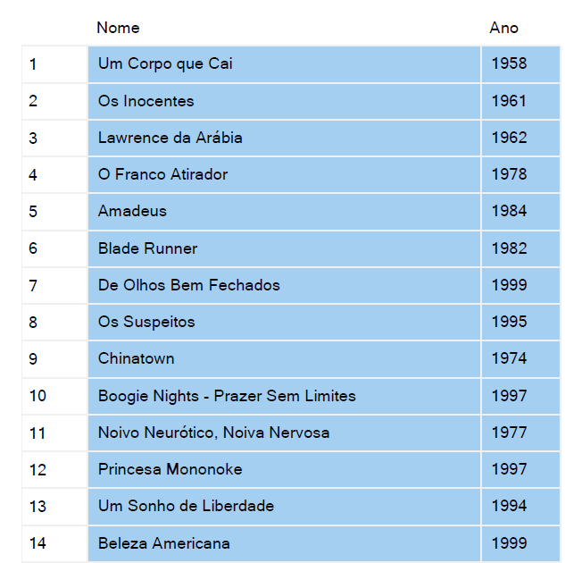

## Consulta 2 

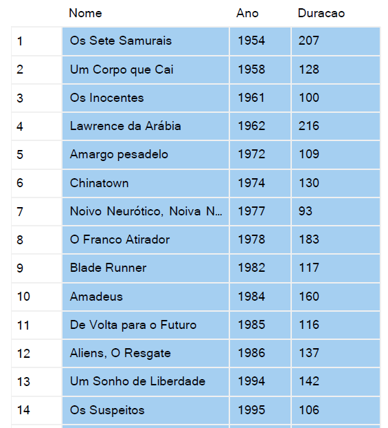

## Consulta 3 

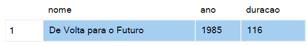

## Consulta 4 

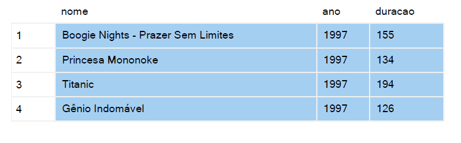

## Consulta 5

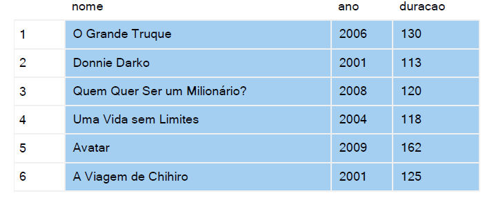

## Consulta 6

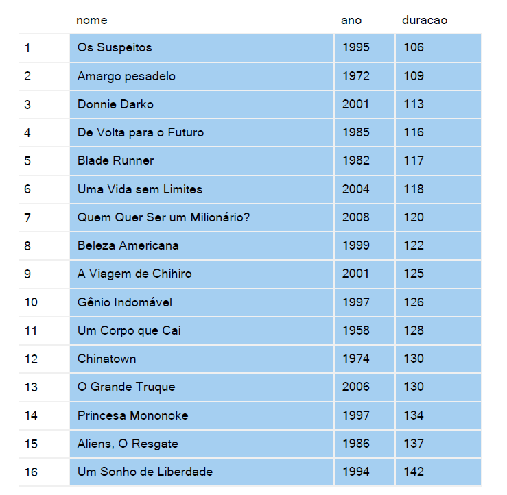

## Consulta 7

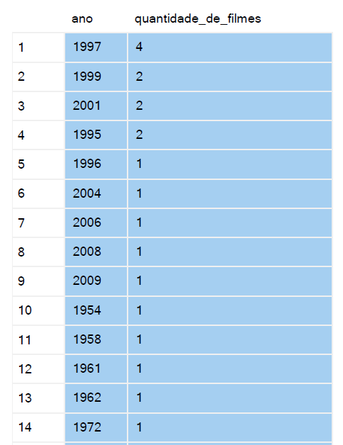

## Consulta 8

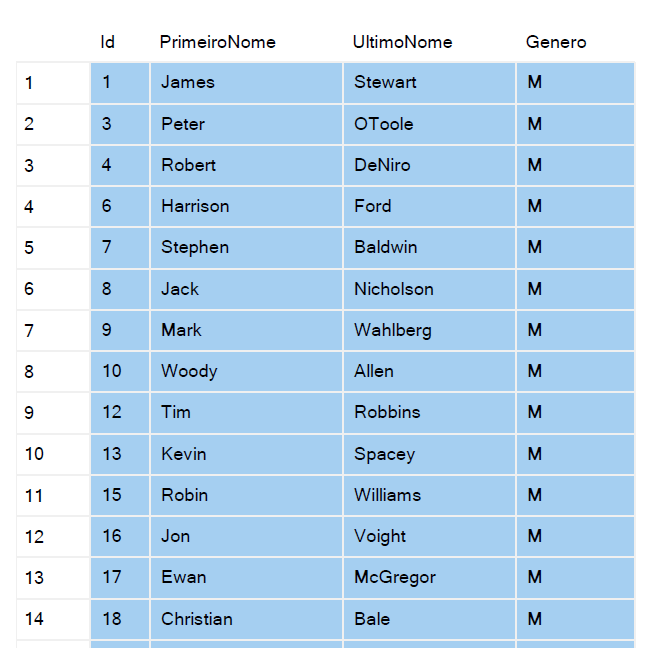

## Consulta 9

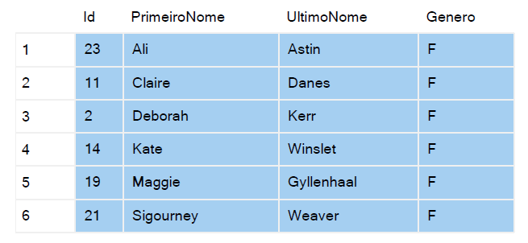

## Consulta 10

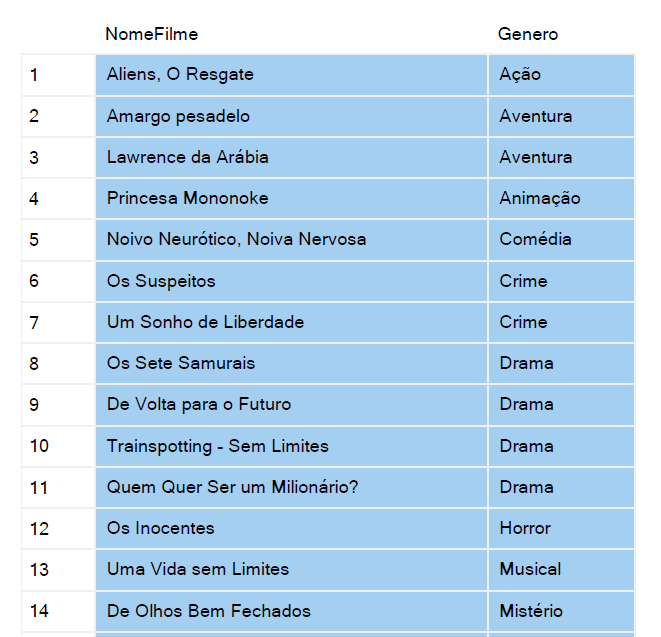

## Consulta 11

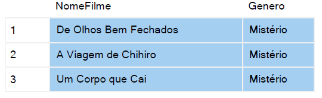

## Consulta 12

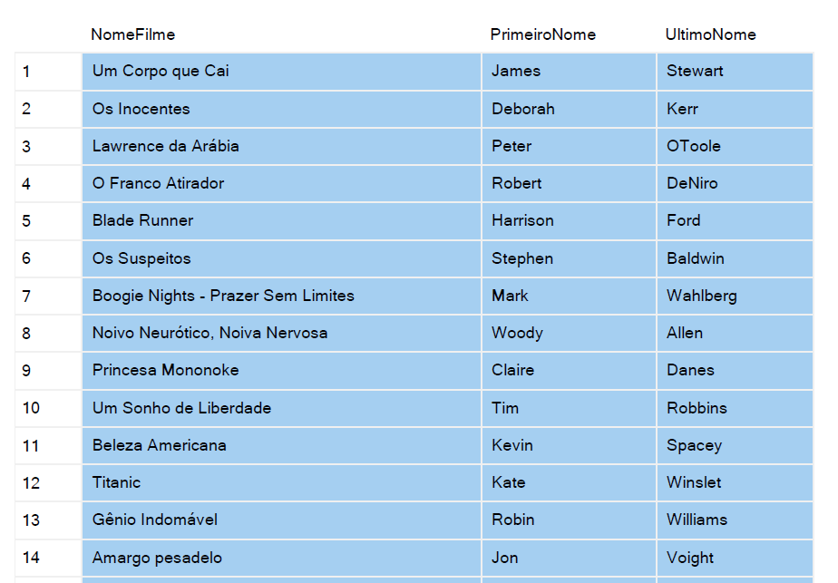

